<p align="center">
    
    
    
     
    <a href="https://github.com/springbear2020/self-hub" target="_blank">
        
    </a>
</p>

[TOC]

# SelfHub（一隅）

`SelfHub`是一款个人管理工具，安放数字生活的私密一隅。

贴心管理您的每一处细节，静享属于自己的从容时光。

## ✨ 核心特性

- 知行合一：每日自律任务打卡与年度热力图可视化
- 财务洞察：专注于分类汇总的个人财务统计分析
- 简洁高效：批量操作支持，减少重复性工作
- 数据私密：本地化 `WSL` 部署，完全掌控个人数据

## 🛠️ 技术栈

**后端**

|      技术栈       |  版本   |
| :---------------: | :-----: |
|        Go         | 1.23.9  |
|       GORM        | 1.25.12 |
| Gin Web Framework | 1.10.0  |

**前端**

|     技术栈     |  版本  |
| :------------: | :----: |
|      Vue       | 3.5.7  |
|  Element Plus  | 2.10.2 |
| Apache ECharts | 5.5.1  |

## 🚀 快速开始

### 后端服务部署

```shell
# 1. 克隆仓库
$ git clone https://github.com/springbear2020/self-hub

# 3. 导入数据库
mysql> source docs/sql/self_hub.sql

# 4. 配置数据库连接
$ vim server/config.yaml

# 5. 使用 GoLand 打开 server 工程模块并运行 main 函数
```

### 前端应用部署

```shell
# 1. 克隆仓库
$ git clone https://github.com/springbear2020/self-hub

# 2. 使用 WebStorm 打开 web 工程模块

# 3. 安装依赖
$ npm install

# 4. 启动开发服务器
$ npm run dev
```

### 默认登录账户

|    用户    |    密码    |   角色   |
| :--------: | :--------: | :------: |
| springbear | springbear | 普通用户 |
|   admin    |   123456   |  管理员  |

## 📱 功能模块

### 🔐 登录页

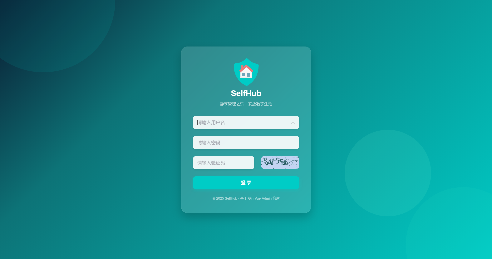

### 📊 知行录

通过热力图可视化全年任务完成情况，培养自律习惯，记录美好生活。

#### 统计看板

- 年度维度任务完成热力图
- 支持计数值和完成备注展示
- 无限滚动懒加载多任务数据

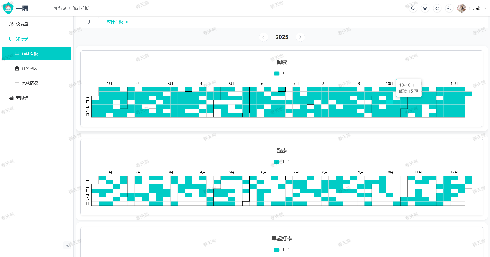


#### 任务列表

- 自定义任务计数值范围、状态和排序
- 配置数据实时同步至统计看板

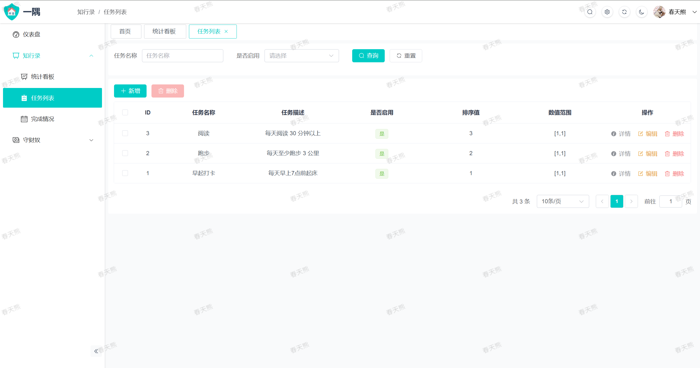

#### 完成情况

- 灵活的任务完成数据录入
- 支持计数值和备注信息记录

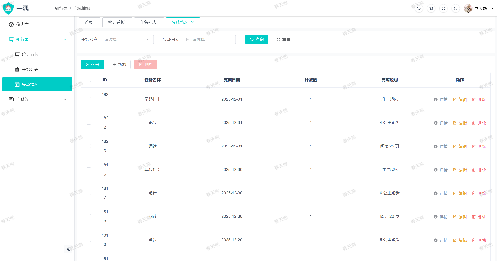

- 今日任务一键批量完成
- 避免重复操作，简化交互


### 💰 守财奴

**设计理念**：本系统并非替代日常记账工具，而是专注于**分类维度的数据统计分析**。

**推荐流程**：

1. 日常账单：每日使用支付宝/微信记账本进行日常账单记录
2. 月度汇总：每月录入分类收支流水，系统自动生成统计看板
3. 明细追踪：对重点关注分类可进一步录入明细数据（如餐饮分三餐、社交分对象）

#### 统计看板

支持自定义时间区间统计，突破第三方记账工具的查询限制，全方位掌握财务动态。

1. 收支余统计卡片

   - 总览月度收支结余情况

     

   - 点击卡片查看月度趋势分析

     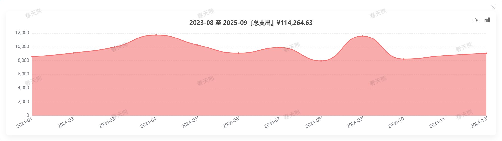

2. 收支余占比饼图

   - 可视化各类别收支比例

     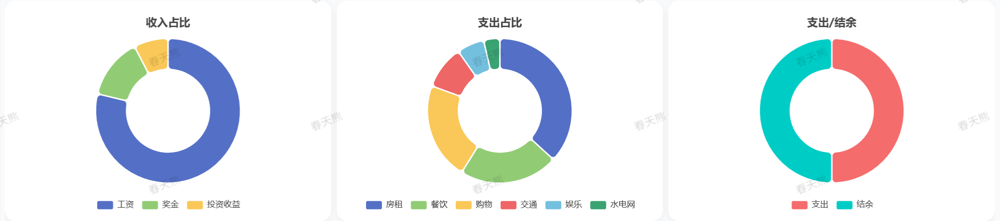

   - 点击饼图查看分类月度趋势

     

3. 收支余趋势折线图

   - 展示收支结余变化趋势

     

   - 点击拐点查看月度分类明细

     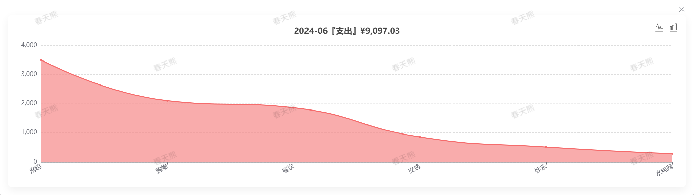

4. 收支明细表格

   - 详细的月度收支数据表格

     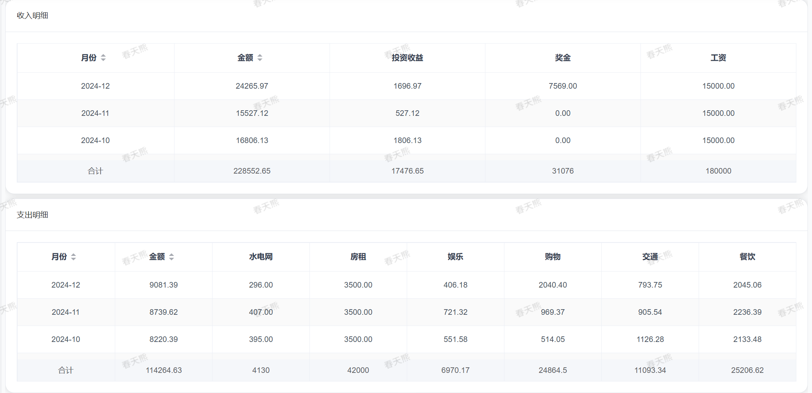

   - 点击行查看分类金额明细

     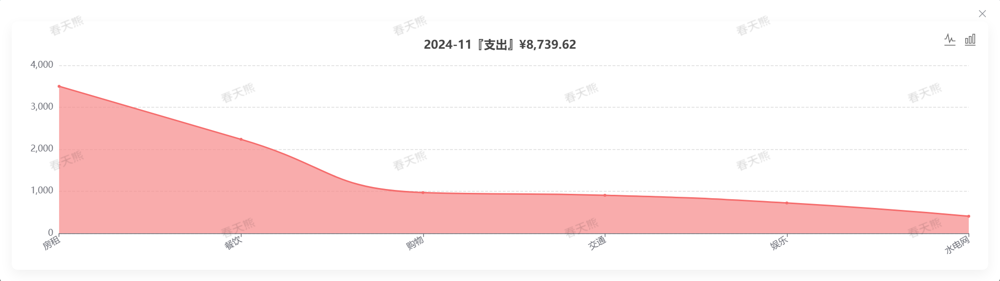

5. 结余汇总表格

   - 月度/年度结余统计分析

     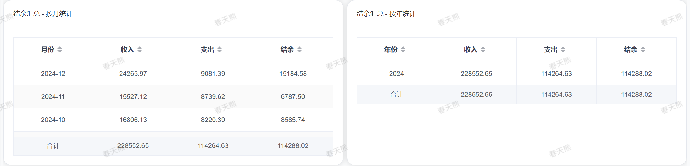

   - 点击行查看详细趋势图表

     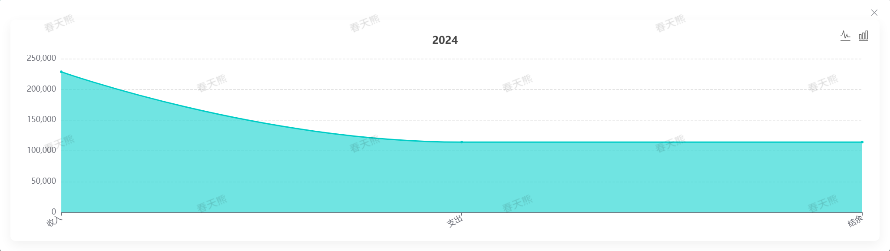

6. 明细汇总表格

   - 按交易分类和对象统计汇总

     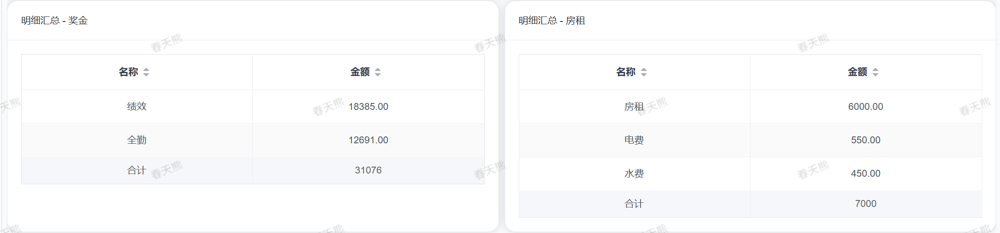

   - 点击行查看月度明细趋势

     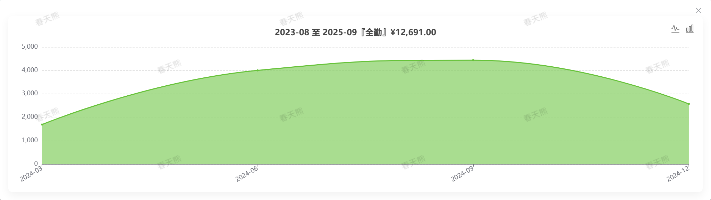

#### 分类列表

- 交易分类的 `CRUD` 管理
- 支持自定义排序配置

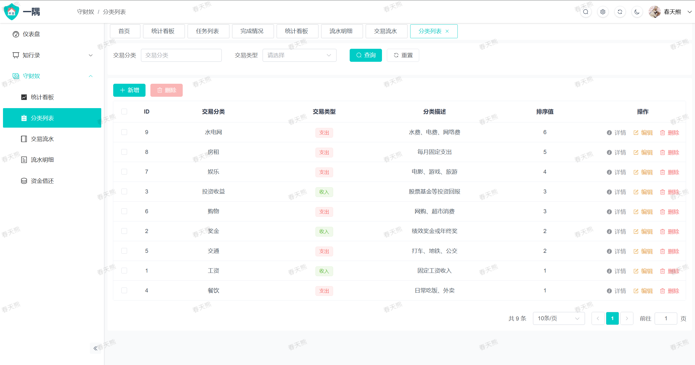

#### 交易流水

- 月度交易分类金额录入
- 统计看板的数据基础

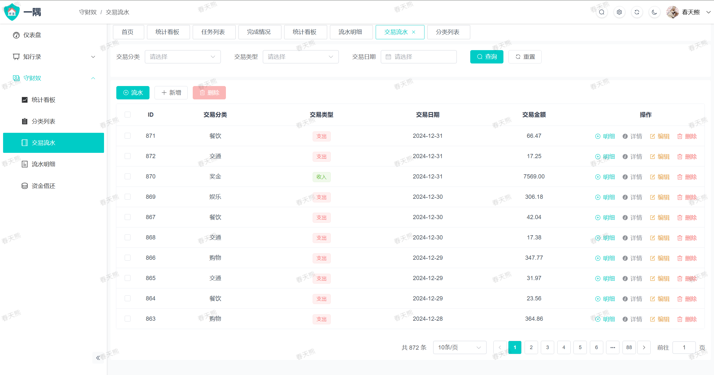

- 月末一键批量录入交易流水和流水明细

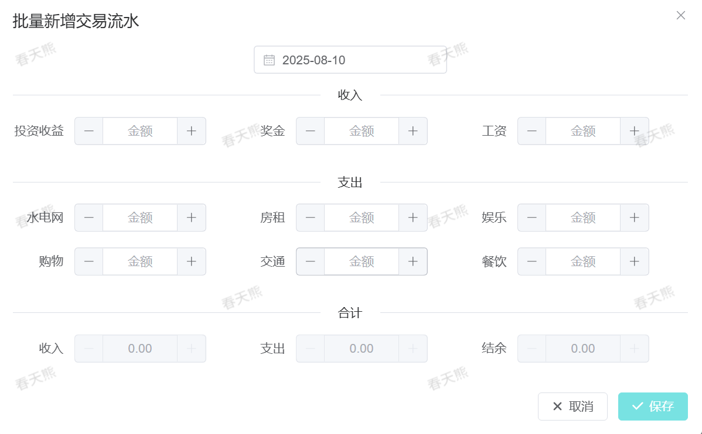

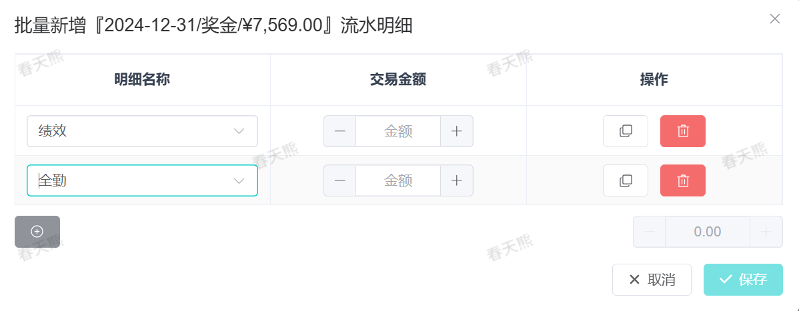

#### 流水明细

- 流水明细绑定到具体交易流水

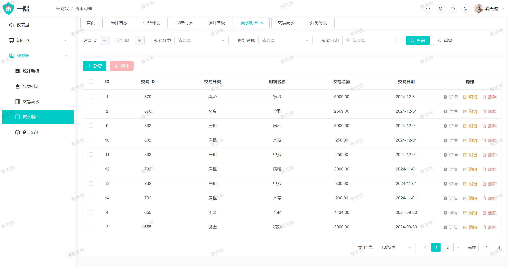

#### 资金借还

- 便捷追踪借出与归还明细
- 自动计算资金状态和结清耗时

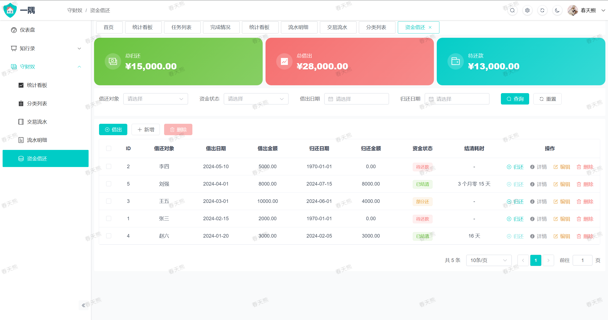

- 人员维度金额汇总统计


## 💝 捐赠支持

如果 `SelfHub` 对您有所帮助，欢迎通过捐赠支持项目的持续开发与维护。您的每一份支持都是我前进的动力！

|  |  |
| :----------------------------------: | :----------------------------------: |

**感谢以下赞助者的支持：**

- *成为第一个赞助者...*

## ⚖️ 开源声明

本项目基于 [Gin-Vue-Admin](https://github.com/flipped-aurora/gin-vue-admin) 二次构建，遵循相关开源协议。

使用说明：

- ✅ 个人学习、研究使用
- ✅ 非商业用途的参考借鉴
- ❌ 未经授权的商业用途

商业使用请尊重知识产权，联系官方获取授权。

## 🤝 参与贡献

欢迎提交 `Issue` 和 `Pull Request` 来共同完善 `SelfHub`！

## 📞 联系我们

- 项目地址：[https://github.com/springbear2020/self-hub](https://github.com/springbear2020/self-hub)
- 如有问题请通过 `GitHub Issues` 反馈

---

<p align="center" style="color: #00ccc6">静享管理之乐，安放数字生活</p>
<p align="center" style="color: #00ccc6">SelfHub 守护您的每一处细节</p>
